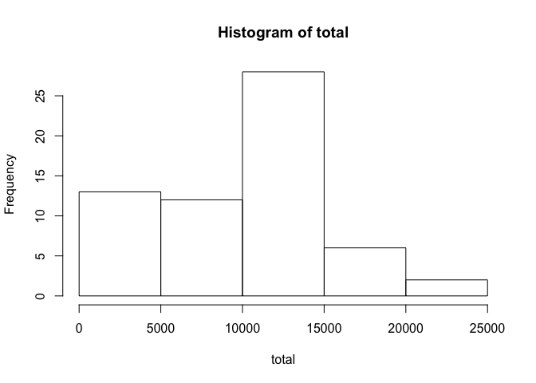
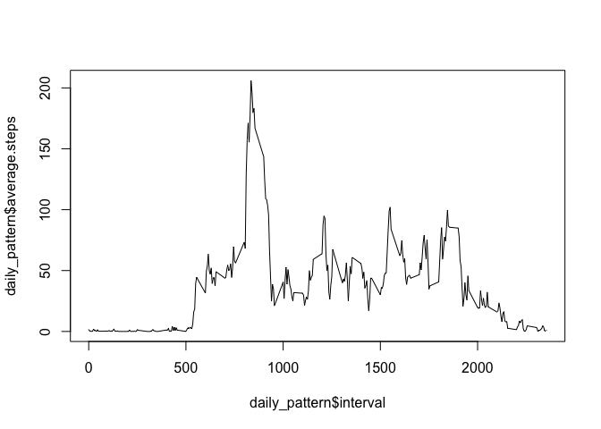
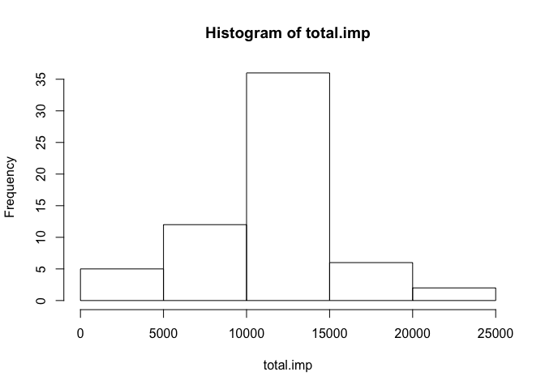
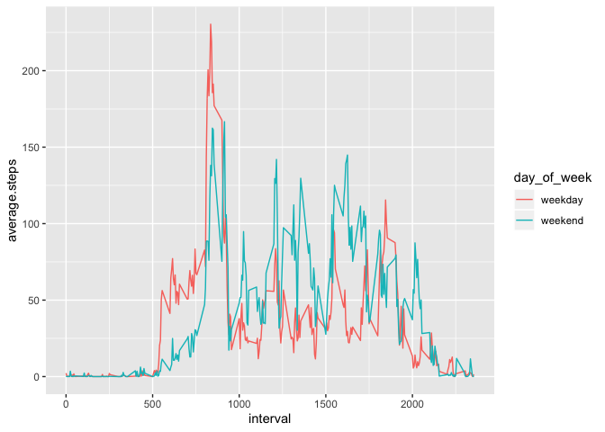

## Loading and preprocessing the data


```r
unzip("activity.zip")
dat <- read.csv("activity.csv")

summary(dat)
```

```
##      steps                date          interval     
##  Min.   :  0.00   2012-10-01:  288   Min.   :   0.0  
##  1st Qu.:  0.00   2012-10-02:  288   1st Qu.: 588.8  
##  Median :  0.00   2012-10-03:  288   Median :1177.5  
##  Mean   : 37.38   2012-10-04:  288   Mean   :1177.5  
##  3rd Qu.: 12.00   2012-10-05:  288   3rd Qu.:1766.2  
##  Max.   :806.00   2012-10-06:  288   Max.   :2355.0  
##  NA's   :2304     (Other)   :15840
```

```r
length(unique(dat$date))
```

```
## [1] 61
```

```r
is.factor(dat$date)
```

```
## [1] TRUE
```


## What is mean total number of steps taken per day?

First we calculate the total steps per day, then we print a histogramm of the total steps taken. IN the code there is also a line with barplot commented out. The information they give is different. The barplot would show the total steps taken for every day over time on x axis. The histogram shows the frequency/distribution of number of steps taken.


```r
total <- tapply(dat$steps, dat$date, sum, na.rm = T)
#View(total)

hist(total) #shows frequency of daily total steps overall
```

<!-- -->

```r
#barplot(total) #shows total steps over time


mean.tot <- mean(total)
median.tot <- median(total)

mean.tot
```

```
## [1] 9354.23
```

```r
median.tot
```

```
## [1] 10395
```

As one can see, the mean of total steps a day is 9354.23, the median is 10395.


## What is the average daily activity pattern?


```r
mean.steps <- tapply(dat$steps, dat$interval, mean, na.rm = T)

daily_pattern <- data.frame(average.steps = mean.steps, interval = unique(dat$interval))


plot(daily_pattern$interval, daily_pattern$average.steps, type = "l")
```

<!-- -->

On first view it seems the highest mean amount of steps is somewhere around the 800 interval. Let us check that.


```r
daily_pattern$interval[daily_pattern$average.steps == max(daily_pattern$average.steps)]
```

```
## [1] 835
```

```r
max(daily_pattern$average.steps)
```

```
## [1] 206.1698
```
The 835 minute interval has the highest mean amount of steps with 206.1698 steps.


## Imputing missing values

How many missing values are in the data?


```r
sum(is.na(dat$steps))
```

```
## [1] 2304
```

```r
sum(is.na(dat$date))
```

```
## [1] 0
```

```r
sum(is.na(dat$interval))
```

```
## [1] 0
```

Missing values are only in the steps column. And there are 2304 missing values (NAs). Let us fill up the NAs with some imputed value.  We take the suggested step, using the median steps of the interval for the day as imputated value.


```r
dat.imputated <- dat

for(i in 1:nrow(dat.imputated)){
  
  if (is.na(dat.imputated$steps[i])){
    dat.imputated$steps[i] <- daily_pattern$average.steps[daily_pattern$interval %in% dat.imputated$interval[i]]
    
  }
}

sum(is.na(dat.imputated))
```

```
## [1] 0
```
Now everything is imputated. Let us look if the exploratory analysis from the beginning now shows different results.


```r
total.imp <- tapply(dat.imputated$steps, dat.imputated$date, sum, na.rm = T)


hist(total.imp) #shows frequency of daily total steps overall
```

<!-- -->

```r
#barplot(total) #shows total steps over time


mean.tot.imp <- mean(total.imp)
median.tot.imp <- median(total.imp)

mean.tot.imp
```

```
## [1] 10766.19
```

```r
median.tot.imp
```

```
## [1] 10766.19
```

Now the mean is different from before. The median hasn't changed. Which makes sense since there are now more median values in the data.
The Distribution also now looks more normal.

## Are there differences in activity patterns between weekdays and weekends?

Lets test this weekdays function!


```r
dat.week <- dat.imputated
dat.week$date <- as.Date(dat.week$date)
dat.week$day <- weekdays(dat.week$date)

weekend <- c("Saturday", "Sunday")

dat.week$day_of_week <- ifelse(dat.week$day %in% weekend, "weekend", "weekday")
```

Because it is late and I am tired, I will go the easy way and make the weekend/weekday plot with ggplot


```r
library(tidyverse)
```

```
## ── Attaching packages ─────────────────────────────────────────────────────────────── tidyverse 1.3.0 ──
```

```
## ✓ ggplot2 3.2.1     ✓ purrr   0.3.3
## ✓ tibble  2.1.3     ✓ dplyr   0.8.3
## ✓ tidyr   1.0.0     ✓ stringr 1.4.0
## ✓ readr   1.3.1     ✓ forcats 0.4.0
```

```
## ── Conflicts ────────────────────────────────────────────────────────────────── tidyverse_conflicts() ──
## x dplyr::filter() masks stats::filter()
## x dplyr::lag()    masks stats::lag()
```

```r
dat.week %>%
  group_by(day_of_week, interval) %>%
  summarize(average.steps = mean(steps)) %>%
  ggplot(aes(x = interval, y = average.steps, colour = day_of_week)) +
  geom_line()
```

<!-- -->

